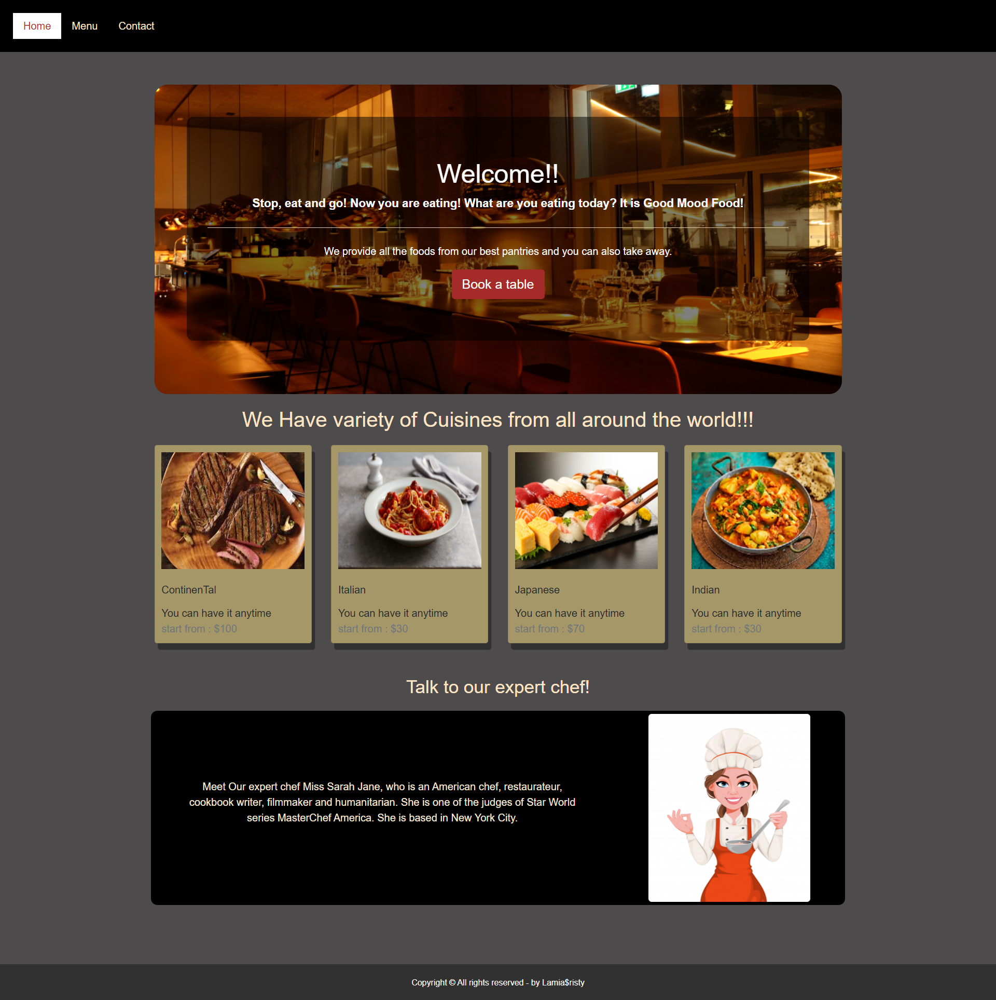

# PROJECT: Restaurant-Homepage
This project is focusing on dynamically rendering a simple restaurant homepage, using DOM manipulation in JavaScript.

## Live Demo:
[Live](https://raw.githack.com/LamiaSristy/Restaurant-Homepage-JS/gh-pages/index.html)

## Screen-shots:

## Build-With

- HTML5
- CSS3
- JavaScript
- VScode

## Getting Started

### Prerequisites

To get this project up and running locally, "npm install" is needed to be run in order to include all dependencies used for this project.

**To get this project set up on your local machine, follow these simple steps:**

1. Open Terminal.
2. Navigate to your desired location to download the contents of this repository.
3. Copy and paste the following code into the Terminal: git clone https://github.com/LamiaSristy/Restaurant-Homepage-JS
4. cd to the folder "dist".
5. click on the "index.html".

**OR if you are using a text editor that provides a live server feature like the VSCode Editor, that can be used as well.**

## Author Details::

👤 **Lamia Sristy**

- Github: [@LamiaSristy](https://github.com/LamiaSristy)
- Linkedin: [@LamiaSristy](https://www.linkedin.com/in/lamia-hemayet-sristy/)
- E-mail: <a href="mailto:lamiasristy@gmail.com?subject=Hello Lamia!">Email</a>  
- Twitter: [@LamiaSristy](https://twitter.com/lsristy1)

## Show your support

Give ⭐ Star me on GitHub — it helps!

## 📝 License

This project is [MIT](lic.url) licensed.   